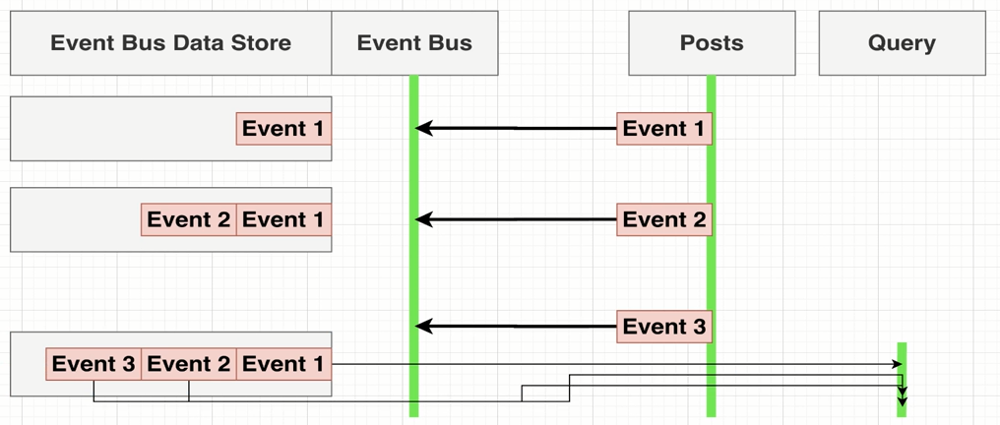
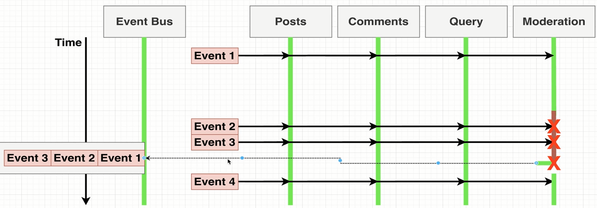

# Mini Microservices App

<h3 align='center'> **Microservices Blog App** — a microservices-based application built with Node.js, Express, Docker, and Kubernetes.
Uses asynchronous communication through a custom Event Bus for service interaction, featuring Post, Comment, Query, and Moderation services with real-time data sync and high scalability. </h3>

## Microservices Architecture

- This project is built using a **Microservices Architecture** approach with **Asynchronous communication** between services.

### Communication Strategy

We use **async communication** (message-based) to minimize direct requests between services — applying a **request minimization strategy** for better scalability and fault tolerance.

Our **Event Bus** is custom-built using **Express.js**.  
It receives events from services and **publishes them to all subscribed listeners**, ensuring that each service stays in sync without direct dependencies.

### Event Synchronization (Handling Missing Events)

To handle **missing or delayed events**, we implement an **event synchronization mechanism**.  
All events passing through the Event Bus are **stored in the Event Bus database**, allowing services to:

- Re-sync missed events if they were temporarily down.
- Keep data consistent across the system.

#### 🔄 Flow Example – “Store Events” Strategy

1. **Post Service** emits events (`Event 1`, `Event 2`, `Event 3`) to the **Event Bus**.
2. The **Event Bus** stores each event in its **Event Bus Data Store** before broadcasting it to all services.
3. If a service (like **Query**) misses an event, it can later **replay all stored events** from the Event Bus database to rebuild its state.

<p align="center">
  
</p>

#### 🔄 Example with Multiple Services (Posts, Comments, Query, Moderation)

Even if one service (e.g., **Moderation**) is temporarily unavailable, the Event Bus continues to store all incoming events.  
Once the service is back online, it can **request the missed events** and process them to maintain data consistency.

<p align="center">
  
</p>

### Benefits

1. **Query Service Independence**  
   The Query service has **zero dependencies** on other services.
2. **High Performance**
   The Query service is **extremely fast** because it works with pre-synced data.
3. **Event Recovery**  
   Services can **recover lost events** automatically through stored event replay.

### Trade-offs

- **Data Duplication**
  This approach introduces **data duplication** across services to achieve faster query performance and better service isolation.

## Docker & Kubernetes

We use **Docker** to containerize all our microservices and **Kubernetes (K8s)** to manage and orchestrate them in production.

Kubernetes handles:

- **Scheduling & Scaling** – runs containers across nodes and scales automatically
- **Self-Healing** – restarts failed containers
- **Service Discovery & Load Balancing** – routes traffic between services
- **Rolling Updates** – deploys new versions with zero downtime

This setup makes our system **portable, reliable, and easy to manage** across environments.

---

## Posts Service

| path    | method | Body                        | Goal                          |
| ------- | ------ | --------------------------- | ----------------------------- |
| /posts  | POST   | {title: string}             | Create a new post             |
| /posts  | GET    | -                           | Retrieve all Posts            |
| /events | POST   | {type: 'PostCreated', data} | Send Event to Event-Bus       |
| /events | POST   | -                           | Received Event from Event-Bus |

## Comments Service

| path                | method | Body                           | Goal                                                    |
| ------------------- | ------ | ------------------------------ | ------------------------------------------------------- |
| /posts/:id/comments | POST   | {content: string}              | Create a comment associated with the given post ID      |
| /posts/:id/comments | GET    | -                              | Retrieve all comments associated with the given post ID |
| /events             | POST   | {type: 'CommentCreated', data} | Send Event to Event-Bus                                 |
| /events             | POST   | -                              | Received Event from Event-Bus                           |

## Query Service

- The Query Service is responsible for serving combined data of posts and their related comments in a single response. (The query service is about presentation logic)
- It listens for events from the Event Bus (such as post or comment creation) and updates its local data store accordingly.
- This approach ensures fast and efficient read operations with zero dependencies on other services.

| path    | method | Body | Goal                                                                           |
| ------- | ------ | ---- | ------------------------------------------------------------------------------ |
| /posts  | Get    | -    | Provide full listing of Posts + Comments in one single request                 |
| /events | POST   | -    | parsing incoming events and saved posts + comments in effecient data structure |

## Moderation Service (important)

- The **Moderation Service** is responsible for automatically reviewing the content of user comments to ensure that inappropriate or flagged text does not appear in the system.
- The **Moderation Service** receives comment-related events from the **Event Bus** and automatically reviews the content of each comment.
- If a comment contains specific flagged words (e.g., “orange”), it updates the comment’s status to **rejected**; otherwise, it marks it as **approved**.
- The default status for all new comments is **pending**.
- After moderation, the service emits an updated event back to the **Event Bus**, which notifies all other services (including the **Query Service and Comment Service**) to keep data consistent and up to date.
- This process provides a smoother and safer user experience by ensuring inappropriate comments are filtered before being displayed.

- in real world commentType maybe (upvoted, downvoted, promoted, anonymized, advertised ..)

---

## client

This is a small, component-based React project that demonstrates a basic blog-style structure — with posts and nested comments.  
It uses a simple and scalable folder organization.

- Create a new post
- View list of posts
- Add comments to any post (with flag do 3 different states 'approved' | 'rejected' | 'pending')
- View comments under each post
- Responsive and clean UI

```
src/
├── components/
│ ├── posts/
│ │ ├── PostList.js # Show all posts
│ │ ├── PostCreate.js # Create new post
│ │ └── PostItem.js # Single post with comments
│ │
│ ├── comments/
│ │ ├── CommentList.js # Show comments for one post
│ │ └── CommentCreate.js # Add a comment
│ │
│ └──
│
│
├── App.js # Root component
├── App.css # Global styles
└── index.js # React entry point
```
